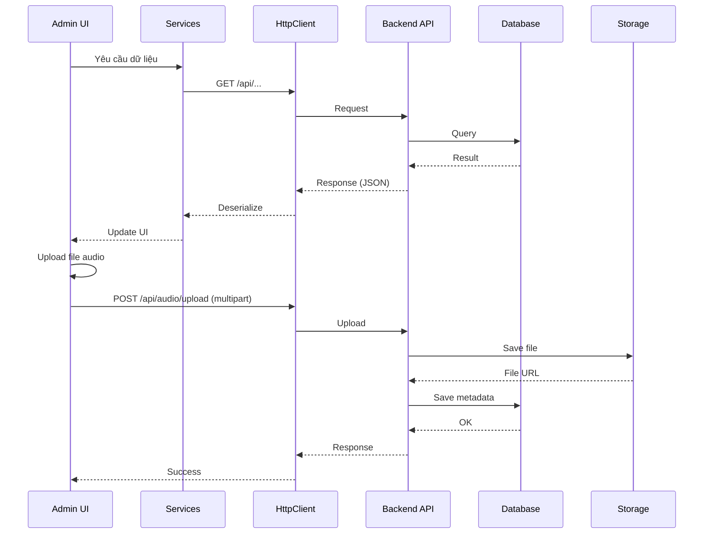

# 📘 TourGuideHCM.Admin - Tài liệu Code Toàn bộ Hệ thống

## 📑 Mục lục
1. [Tổng quan kiến trúc](#tổng-quan-kiến-trúc)
2. [Models (DTO)](#models-dto)
3. [Services](#services)
4. [UI Components (Razor)](#ui-components-razor)
5. [Luồng tương tác (Sequence Diagram)](#luồng-tương-tác)

---

## 🏗️ Tổng quan kiến trúc

**TourGuideHCM.Admin** là một ứng dụng **Blazor WebAssembly** với ASP.NET Core 8, MudBlazor UI, và Service-based architecture.

---

## 📦 Models (DTO)

### 1. **AudioDto.cs**
- Id, PoiId, PoiName, Language, AudioUrl, DurationSeconds, Description, IsActive, FileName

### 2. **PoiDto.cs**
- Id, Name, Description, Address, Lat, Lng, ImageUrl, CategoryId

### 3. **UserDto.cs**
- Id, FullName, Email, Phone, Role (User/Admin/Guide), IsActive, CreatedDate, TotalListens

### 4. **DashboardDto.cs**
- TotalPoi, TotalUsers, TopPoi, AvgTime, TopPois, DailyViews

---

## 🔧 Services

### PoiService
- GetAll() → GET /api/poi
- Create(PoiDto) → POST /api/poi
- Update(PoiDto) → PUT /api/poi/{id}
- Delete(int id) → DELETE /api/poi/{id}

### AudioService
- GetAllAsync() → GET /api/audio
- GetByPoiIdAsync(poiId) → GET /api/audio/poi/{poiId}
- UploadAudioAsync(content) → POST /api/audio/upload
- CreateAsync(audio) → POST /api/audio
- UpdateAsync(audio) → PUT /api/audio/{id}
- DeleteAsync(id) → DELETE /api/audio/{id}
- LogPlayback(userId, poiId, durationSeconds) → POST /api/playback

### UserService
- GetAllAsync() → GET /api/users
- CreateAsync(user) → POST /api/users
- UpdateAsync(user) → PUT /api/users/{id}
- DeleteAsync(id) → DELETE /api/users/{id}
- ToggleActiveAsync(id) → PUT /api/users/{id}/toggle-active

### AnalyticsService
- GetDashboard() → GET /api/analytics/dashboard

---

## 🎨 UI Components

### Audio.razor
- Hiển thị danh sách audio guide
- Tìm kiếm real-time theo POI/ngôn ngữ
- Nghe preview audio trong bảng
- Thêm/Sửa/Xóa audio

### AudioDialog.razor
- Tab 1: TTS (Text-to-Speech)
  - Nhập nội dung, chọn language/gender/speed
  - Convert & Lưu ngay → /api/audio/convert
- Tab 2: Upload File
  - Upload file audio (mp3, wav, m4a, ogg, aac, max 20MB)
  - Nhập URL trực tiếp
  - Lưu metadata vào DB

---

## 📊 Sequence Diagram

---

## ⚙️ Setup

Program.cs DI:
- AddMudServices()
- HttpClient (BaseAddress: localhost:5284)
- PoiService, AudioService, UserService, AnalyticsService, PlaybackService
