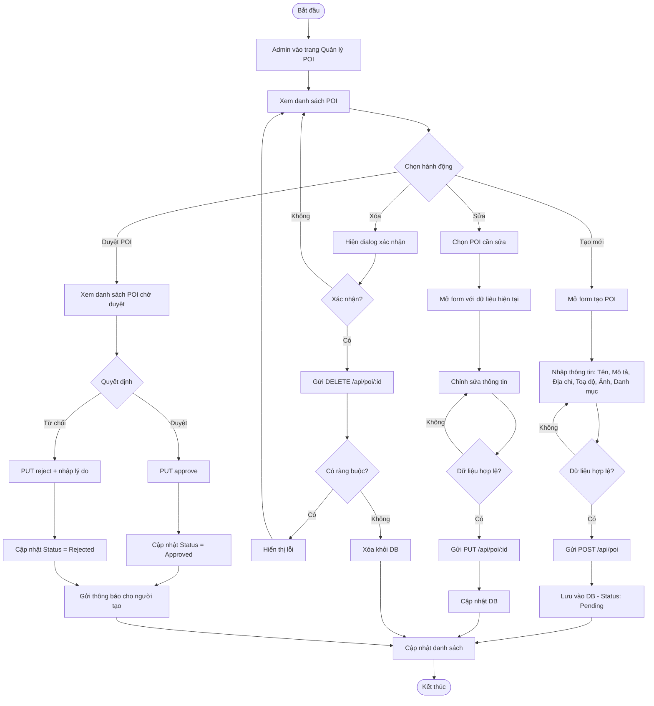
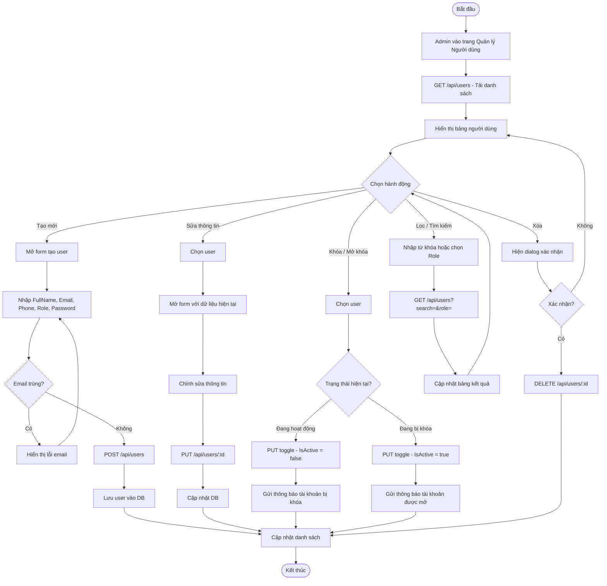
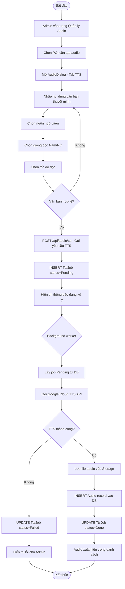
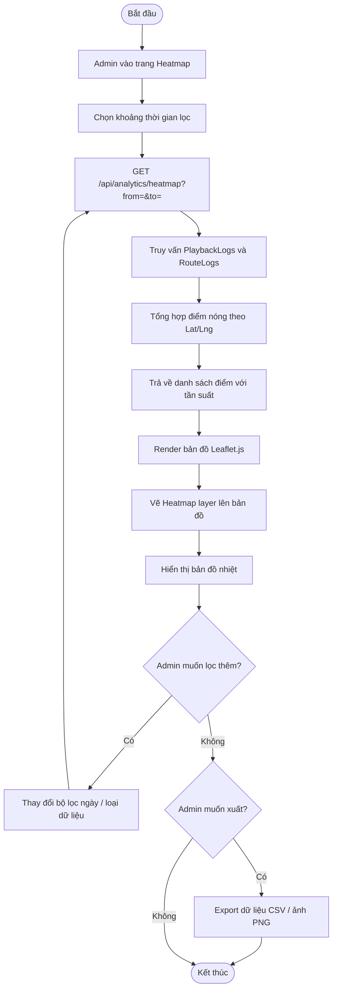
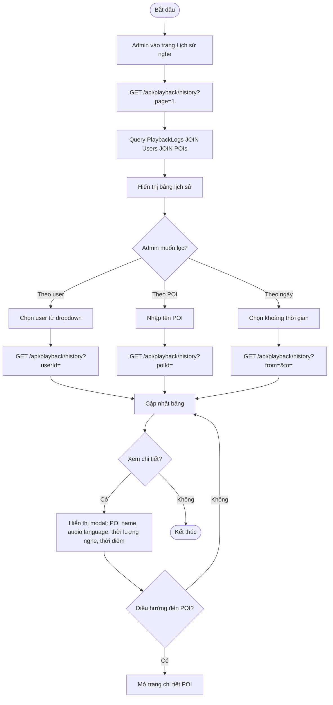
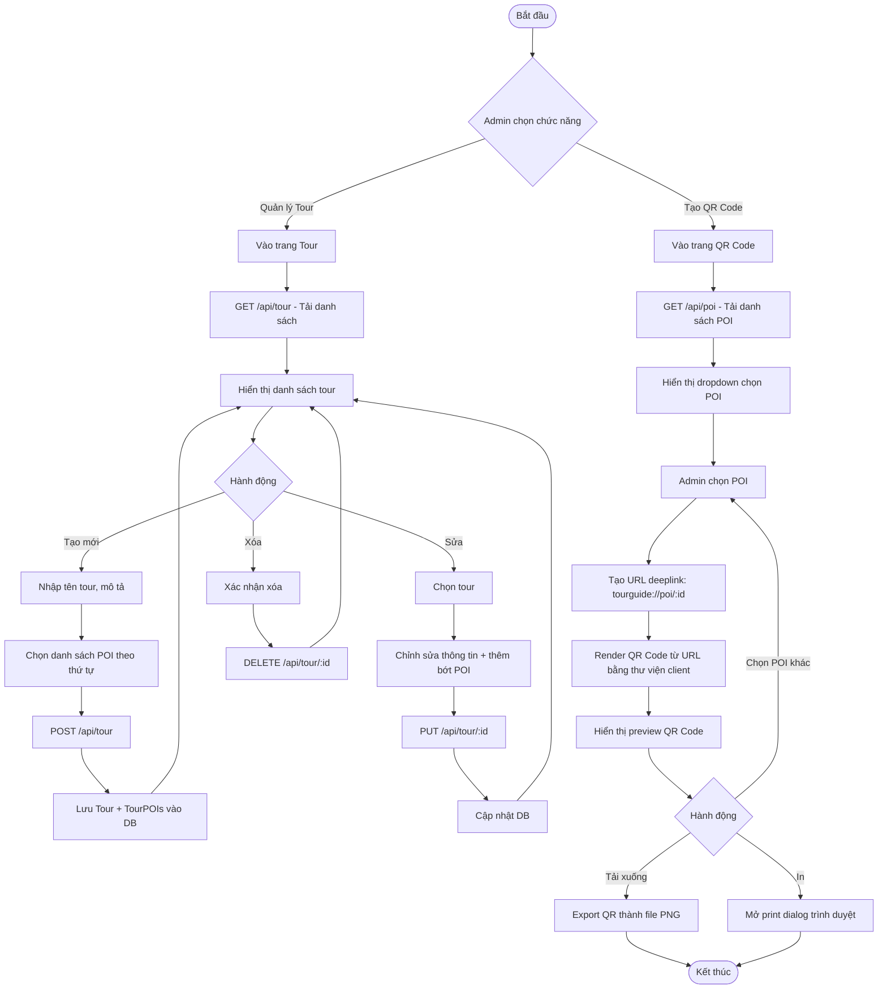
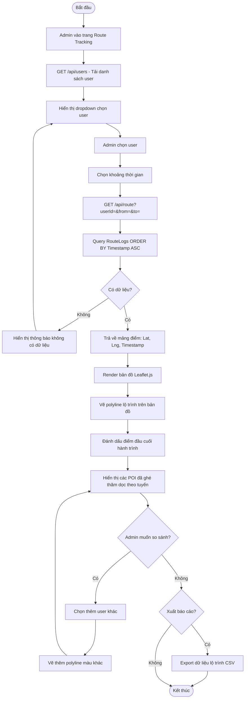
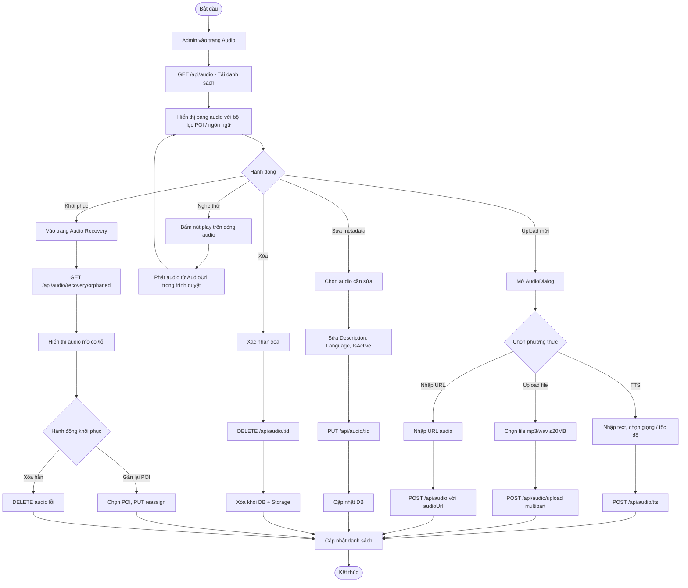

# Sơ đồ Hoạt động (Activity Diagram) - Admin

---

## 1. Quản lý địa điểm POI

---

## 2. Quản lý người dùng

---

## 3. Tạo audio thuyết minh (TTS)

---

## 4. Xem Heatmap

---

## 5. Xem lịch sử nghe (Playback History)

---

## 6. Quản lý tour và tạo QR Code

---

## 7. Theo dõi tuyến di chuyển người dùng

---

## 8. Quản lý audio (xem, sửa, xóa, khôi phục)

