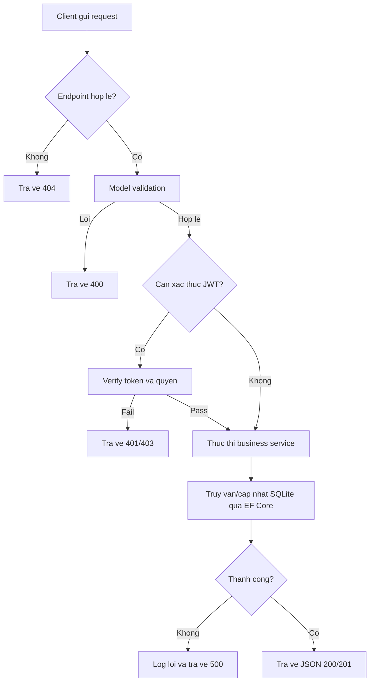

# Activity Diagram - API Module

```mermaid
flowchart TD
    A[Client gui request] --> B{Endpoint hop le?}
    B -- Khong --> C[Tra ve 404]
    B -- Co --> D[Model validation]
    D -- Loi --> E[Tra ve 400]
    D -- Hop le --> F{Can xac thuc JWT?}
    F -- Co --> G[Verify token va quyen]
    G -- Fail --> H[Tra ve 401/403]
    G -- Pass --> I[Thuc thi business service]
    F -- Khong --> I
    I --> J[Truy van/cap nhat SQLite qua EF Core]
    J --> K{Thanh cong?}
    K -- Khong --> L[Log loi va tra ve 500]
    K -- Co --> M[Tra ve JSON 200/201]
```
