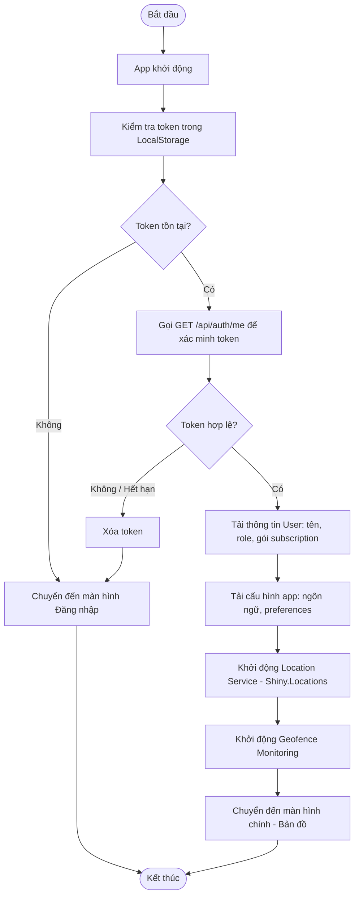
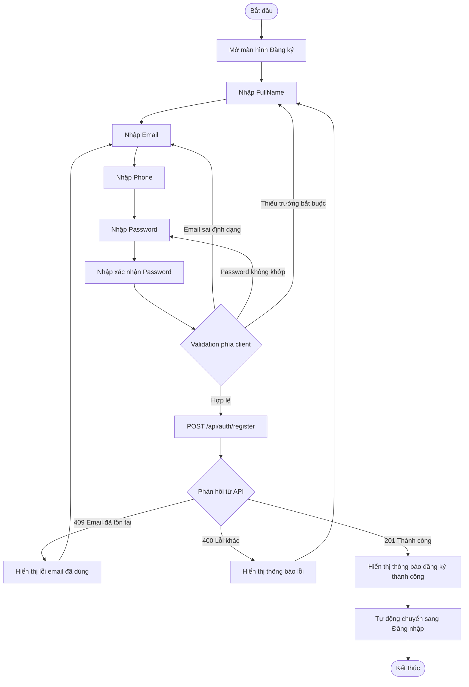
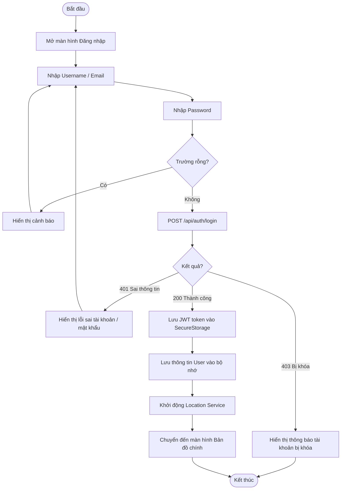
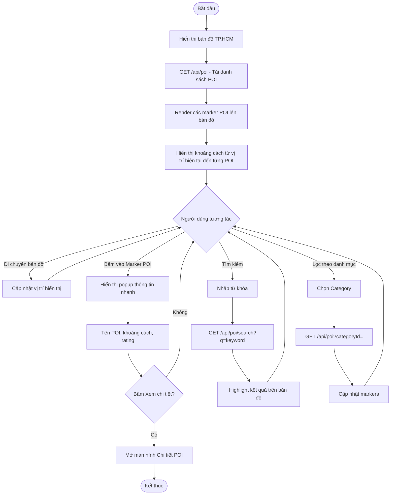
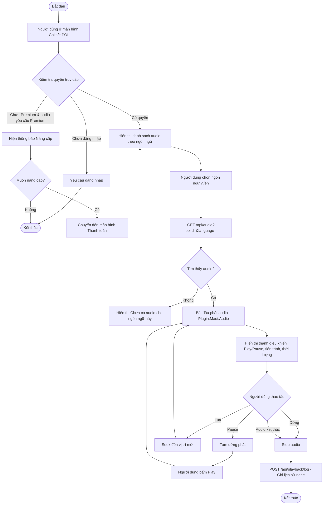
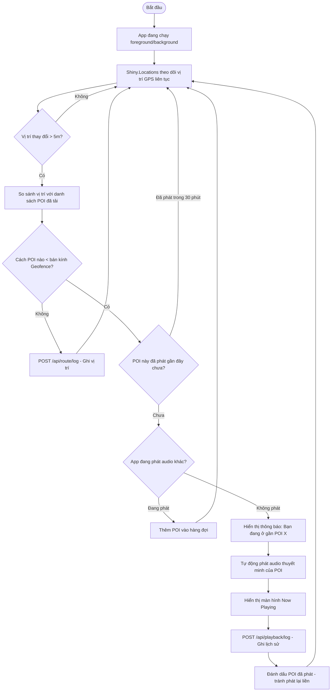
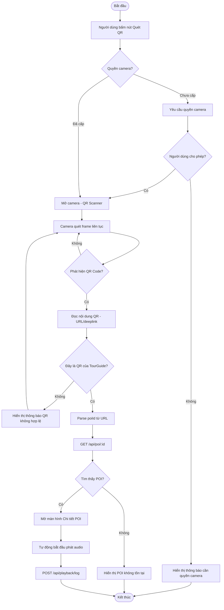
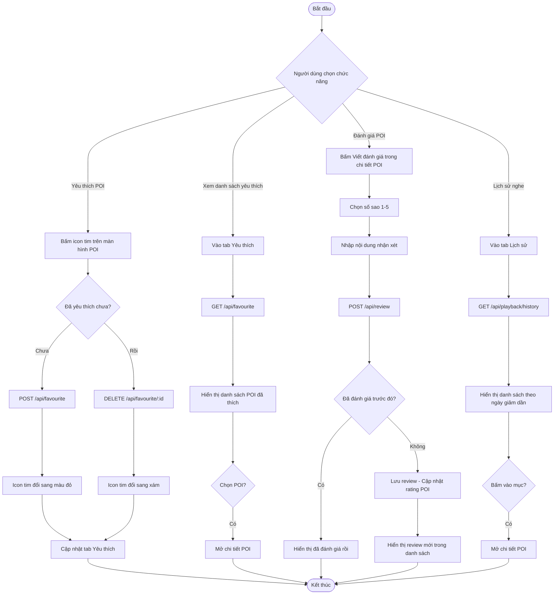

# Sơ đồ Hoạt động (Activity Diagram) - App

---

## 1. Khởi động ứng dụng

---

## 2. Đăng ký tài khoản

---

## 3. Đăng nhập

---

## 4. Xem bản đồ và chọn POI

---

## 5. Nghe thuyết minh (thủ công)

---

## 6. Geofence tự động phát audio

---

## 7. Quét QR Code

---

## 8. Yêu thích, Đánh giá và Lịch sử

