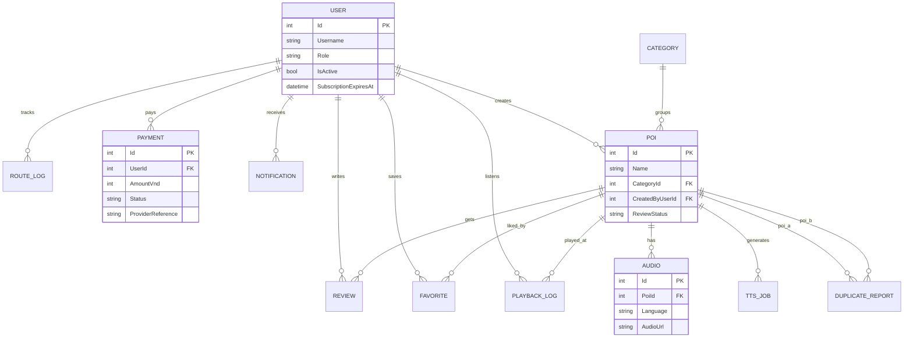

# ERD - API Module

```mermaid
erDiagram
    USER ||--o{ REVIEW : writes
    USER ||--o{ FAVORITE : saves
    USER ||--o{ PLAYBACK_LOG : listens
    USER ||--o{ ROUTE_LOG : tracks
    USER ||--o{ PAYMENT : pays
    USER ||--o{ NOTIFICATION : receives
    USER ||--o{ POI : creates

    CATEGORY ||--o{ POI : groups
    POI ||--o{ AUDIO : has
    POI ||--o{ REVIEW : gets
    POI ||--o{ FAVORITE : liked_by
    POI ||--o{ PLAYBACK_LOG : played_at
    POI ||--o{ TTS_JOB : generates

    POI ||--o{ DUPLICATE_REPORT : poi_a
    POI ||--o{ DUPLICATE_REPORT : poi_b

    USER {
      int Id PK
      string Username
      string Role
      bool IsActive
      datetime SubscriptionExpiresAt
    }

    POI {
      int Id PK
      string Name
      int CategoryId FK
      int CreatedByUserId FK
      string ReviewStatus
    }

    AUDIO {
      int Id PK
      int PoiId FK
      string Language
      string AudioUrl
    }

    PAYMENT {
      int Id PK
      int UserId FK
      int AmountVnd
      string Status
      string ProviderReference
    }
```
