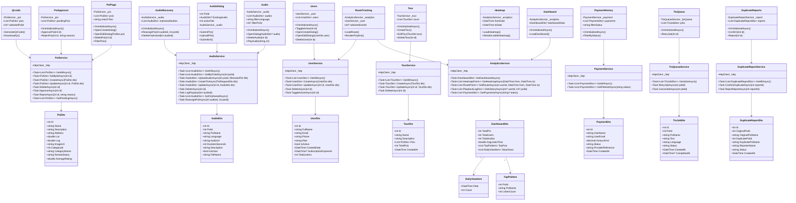

# Sơ đồ Lớp (Class Diagram) - Admin (Blazor WebAssembly)

```mermaid
classDiagram
    %% ========== DTOs ==========
    class PoiDto {
        +int Id
        +string Name
        +string Description
        +string Address
        +double Lat
        +double Lng
        +string ImageUrl
        +int CategoryId
        +string CategoryName
        +string ReviewStatus
        +double AverageRating
    }

    class AudioDto {
        +int Id
        +int PoiId
        +string PoiName
        +string Language
        +string AudioUrl
        +int DurationSeconds
        +string Description
        +bool IsActive
        +string FileName
    }

    class UserDto {
        +int Id
        +string FullName
        +string Email
        +string Phone
        +string Role
        +bool IsActive
        +DateTime CreatedDate
        +DateTime? SubscriptionExpiresAt
        +int TotalListens
    }

    class TourDto {
        +int Id
        +string Name
        +string Description
        +List~PoiDto~ Pois
        +int TotalPois
        +DateTime CreatedAt
    }

    class DashboardDto {
        +int TotalPoi
        +int TotalUsers
        +int TotalAudios
        +double AvgListenTime
        +List~TopPoiItem~ TopPois
        +List~DailyViewItem~ DailyViews
    }

    class TopPoiItem {
        +int PoiId
        +string PoiName
        +int ListenCount
    }

    class DailyViewItem {
        +DateTime Date
        +int Count
    }

    class PaymentDto {
        +int Id
        +string UserName
        +string UserEmail
        +decimal AmountVnd
        +string Status
        +string ProviderReference
        +DateTime CreatedAt
    }

    class TtsJobDto {
        +int Id
        +int PoiId
        +string PoiName
        +string Text
        +string Language
        +string Status
        +DateTime CreatedAt
        +DateTime? CompletedAt
    }

    class DuplicateReportDto {
        +int Id
        +int OriginalPoiId
        +string OriginalPoiName
        +int DuplicatePoiId
        +string DuplicatePoiName
        +string ReporterName
        +string Status
        +DateTime CreatedAt
    }

    DashboardDto "1" --> "*" TopPoiItem
    DashboardDto "1" --> "*" DailyViewItem

    %% ========== Services ==========
    class PoiService {
        -HttpClient _http
        +Task~List~PoiDto~~ GetAllAsync()
        +Task~PoiDto~ GetByIdAsync(int id)
        +Task~PoiDto~ CreateAsync(PoiDto dto)
        +Task~PoiDto~ UpdateAsync(int id, PoiDto dto)
        +Task DeleteAsync(int id)
        +Task ApproveAsync(int id)
        +Task RejectAsync(int id, string reason)
        +Task~List~PoiDto~~ GetPendingAsync()
    }

    class AudioService {
        -HttpClient _http
        +Task~List~AudioDto~~ GetAllAsync()
        +Task~List~AudioDto~~ GetByPoiIdAsync(int poiId)
        +Task~AudioDto~ UploadAudioAsync(int poiId, IBrowserFile file)
        +Task~AudioDto~ CreateTtsAsync(TtsRequestDto dto)
        +Task~AudioDto~ UpdateAsync(int id, AudioDto dto)
        +Task DeleteAsync(int id)
        +Task LogPlayback(int audioId)
        +Task~List~AudioDto~~ GetOrphanedAsync()
        +Task ReassignPoiAsync(int audioId, int poiId)
    }

    class UserService {
        -HttpClient _http
        +Task~List~UserDto~~ GetAllAsync()
        +Task~UserDto~ CreateAsync(UserDto dto)
        +Task~UserDto~ UpdateAsync(int id, UserDto dto)
        +Task DeleteAsync(int id)
        +Task ToggleActiveAsync(int id)
    }

    class TourService {
        -HttpClient _http
        +Task~List~TourDto~~ GetAllAsync()
        +Task~TourDto~ CreateAsync(TourDto dto)
        +Task~TourDto~ UpdateAsync(int id, TourDto dto)
        +Task DeleteAsync(int id)
    }

    class AnalyticsService {
        -HttpClient _http
        +Task~DashboardDto~ GetDashboardAsync()
        +Task~List~HeatmapPoint~~ GetHeatmapAsync(DateTime from, DateTime to)
        +Task~List~RoutePoint~~ GetRouteAsync(int userId, DateTime from, DateTime to)
        +Task~List~PlaybackLogDto~~ GetHistoryAsync(int? userId, int? poiId)
        +Task~List~PaymentDto~~ GetPaymentsAsync(string? status)
    }

    class PaymentService {
        -HttpClient _http
        +Task~List~PaymentDto~~ GetAllAsync()
        +Task~List~PaymentDto~~ GetFilteredAsync(string status)
    }

    class TtsQueueService {
        -HttpClient _http
        +Task~List~TtsJobDto~~ GetJobsAsync()
        +Task RetryJobAsync(int jobId)
        +Task CancelJobAsync(int jobId)
    }

    class DuplicateReportService {
        -HttpClient _http
        +Task~List~DuplicateReportDto~~ GetAllAsync()
        +Task ConfirmDuplicateAsync(int reportId)
        +Task RejectReportAsync(int reportId)
    }

    %% ========== Razor Pages ==========
    class Dashboard {
        -AnalyticsService _analytics
        +DashboardDto? dashboardData
        +OnInitializedAsync()
        +LoadDashboard()
    }

    class PoiPage {
        -PoiService _poi
        +List~PoiDto~ pois
        +string searchText
        +OnInitializedAsync()
        +OpenCreateDialog()
        +OpenEditDialog(PoiDto poi)
        +DeletePoi(int id)
        +FilterPois()
    }

    class PoiApproval {
        -PoiService _poi
        +List~PoiDto~ pendingPois
        +OnInitializedAsync()
        +ApprovePoi(int id)
        +RejectPoi(int id, string reason)
    }

    class Audio {
        -AudioService _audio
        +List~AudioDto~ audios
        +string filterLanguage
        +int? filterPoiId
        +OnInitializedAsync()
        +OpenDialog(AudioDto? audio)
        +DeleteAudio(int id)
        +PlayAudio(string url)
    }

    class AudioDialog {
        +int PoiId
        +AudioDto? ExistingAudio
        +int activeTab
        -AudioService _audio
        +SubmitTts()
        +UploadFile()
        +SubmitUrl()
    }

    class Users {
        -UserService _user
        +List~UserDto~ users
        +OnInitializedAsync()
        +ToggleActive(int id)
        +OpenCreateDialog()
        +OpenEditDialog(UserDto user)
        +DeleteUser(int id)
    }

    class Tour {
        -TourService _tour
        +List~TourDto~ tours
        +OnInitializedAsync()
        +CreateTour()
        +EditTour(TourDto tour)
        +DeleteTour(int id)
    }

    class Heatmap {
        -AnalyticsService _analytics
        +DateTime fromDate
        +DateTime toDate
        +LoadHeatmap()
        +RenderLeafletHeatmap()
    }

    class RouteTracking {
        -AnalyticsService _analytics
        -UserService _user
        +int? selectedUserId
        +LoadRoute()
        +RenderPolyline()
    }

    class TtsQueue {
        -TtsQueueService _ttsQueue
        +List~TtsJobDto~ jobs
        +OnInitializedAsync()
        +RetryJob(int id)
    }

    class DuplicateReports {
        -DuplicateReportService _report
        +List~DuplicateReportDto~ reports
        +OnInitializedAsync()
        +Confirm(int id)
        +Reject(int id)
    }

    class PaymentHistory {
        -PaymentService _payment
        +List~PaymentDto~ payments
        +string filterStatus
        +OnInitializedAsync()
        +FilterByStatus()
    }

    class Qrcode {
        -PoiService _poi
        +List~PoiDto~ pois
        +int? selectedPoiId
        +GenerateQrCode()
        +DownloadQr()
    }

    class AudioRecovery {
        -AudioService _audio
        +List~AudioDto~ orphanedAudios
        +OnInitializedAsync()
        +ReassignPoi(int audioId, int poiId)
        +DeleteOrphaned(int audioId)
    }

    %% ========== Relationships ==========
    Dashboard --> AnalyticsService
    PoiPage --> PoiService
    PoiApproval --> PoiService
    Audio --> AudioService
    AudioDialog --> AudioService
    Users --> UserService
    Tour --> TourService
    Heatmap --> AnalyticsService
    RouteTracking --> AnalyticsService
    RouteTracking --> UserService
    TtsQueue --> TtsQueueService
    DuplicateReports --> DuplicateReportService
    PaymentHistory --> PaymentService
    Qrcode --> PoiService
    AudioRecovery --> AudioService

    PoiService --> PoiDto
    AudioService --> AudioDto
    UserService --> UserDto
    TourService --> TourDto
    AnalyticsService --> DashboardDto
    PaymentService --> PaymentDto
    TtsQueueService --> TtsJobDto
    DuplicateReportService --> DuplicateReportDto
```
