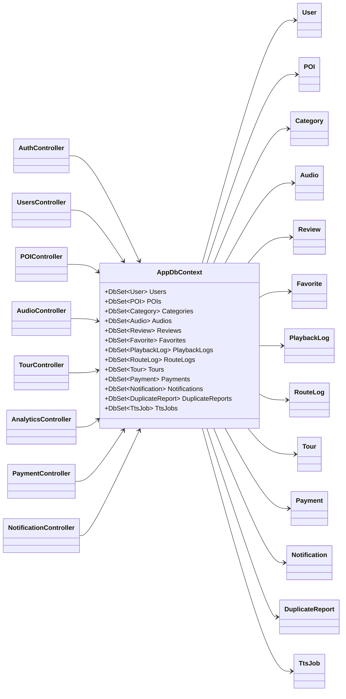

# Class Diagram - API Module

```mermaid
classDiagram
direction LR

class AppDbContext {
  +DbSet~User~ Users
  +DbSet~POI~ POIs
  +DbSet~Category~ Categories
  +DbSet~Audio~ Audios
  +DbSet~Review~ Reviews
  +DbSet~Favorite~ Favorites
  +DbSet~PlaybackLog~ PlaybackLogs
  +DbSet~RouteLog~ RouteLogs
  +DbSet~Tour~ Tours
  +DbSet~Payment~ Payments
  +DbSet~Notification~ Notifications
  +DbSet~DuplicateReport~ DuplicateReports
  +DbSet~TtsJob~ TtsJobs
}

class AuthController
class UsersController
class POIController
class AudioController
class TourController
class AnalyticsController
class PaymentController
class NotificationController

class User
class POI
class Category
class Audio
class Review
class Favorite
class PlaybackLog
class RouteLog
class Tour
class Payment
class Notification
class DuplicateReport
class TtsJob

AuthController --> AppDbContext
UsersController --> AppDbContext
POIController --> AppDbContext
AudioController --> AppDbContext
TourController --> AppDbContext
AnalyticsController --> AppDbContext
PaymentController --> AppDbContext
NotificationController --> AppDbContext

AppDbContext --> User
AppDbContext --> POI
AppDbContext --> Category
AppDbContext --> Audio
AppDbContext --> Review
AppDbContext --> Favorite
AppDbContext --> PlaybackLog
AppDbContext --> RouteLog
AppDbContext --> Tour
AppDbContext --> Payment
AppDbContext --> Notification
AppDbContext --> DuplicateReport
AppDbContext --> TtsJob
```
