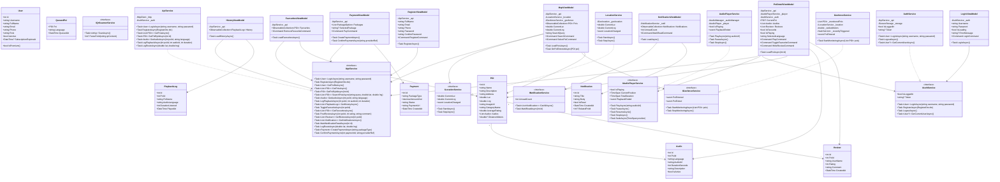

# Sơ đồ Lớp (Class Diagram) - App (MAUI)

```mermaid
classDiagram
    %% ========== Models ==========
    class User {
        +int Id
        +string Username
        +string FullName
        +string Email
        +string Phone
        +string Role
        +bool IsActive
        +DateTime? SubscriptionExpiresAt
        +bool IsPremium()
    }

    class POI {
        +int Id
        +string Name
        +string Description
        +string Address
        +double Lat
        +double Lng
        +string ImageUrl
        +string CategoryName
        +double AverageRating
        +List~Audio~ Audios
        +double? DistanceMeters
    }

    class Audio {
        +int Id
        +int PoiId
        +string Language
        +string AudioUrl
        +int DurationSeconds
        +string Description
        +bool IsActive
    }

    class QueuedPoi {
        +POI Poi
        +string Language
        +DateTime QueuedAt
    }

    class Review {
        +int Id
        +int PoiId
        +string UserName
        +int Rating
        +string Comment
        +DateTime CreatedAt
    }

    class PlaybackLog {
        +int Id
        +int PoiId
        +string PoiName
        +string AudioLanguage
        +int DurationListened
        +DateTime PlayedAt
    }

    class Notification {
        +int Id
        +string Title
        +string Body
        +bool IsRead
        +DateTime CreatedAt
        +int? RelatedPoiId
    }

    class Payment {
        +int Id
        +string PackageType
        +decimal AmountVnd
        +string Status
        +string PaymentUrl
        +DateTime CreatedAt
    }

    POI "1" --> "*" Audio
    POI "1" --> "*" Review

    %% ========== Services Interfaces ==========
    class IApiService {
        <<interface>>
        +Task~User~ LoginAsync(string username, string password)
        +Task RegisterAsync(RegisterDto dto)
        +Task~User~ GetProfileAsync()
        +Task~List~POI~~ GetPoisAsync()
        +Task~POI~ GetPoiByIdAsync(int id)
        +Task~List~POI~~ SearchPoisAsync(string query, double lat, double lng)
        +Task~Audio~ GetAudioAsync(int poiId, string language)
        +Task LogPlaybackAsync(int poiId, int audioId, int duration)
        +Task~List~PlaybackLog~~ GetHistoryAsync()
        +Task ToggleFavouriteAsync(int poiId)
        +Task~List~POI~~ GetFavouritesAsync()
        +Task PostReviewAsync(int poiId, int rating, string comment)
        +Task~List~Review~~ GetReviewsAsync(int poiId)
        +Task~List~Notification~~ GetNotificationsAsync()
        +Task MarkNotificationReadAsync(int id)
        +Task LogRouteAsync(double lat, double lng)
        +Task~Payment~ CreatePaymentAsync(string packageType)
        +Task ConfirmPaymentAsync(int paymentId, string providerRef)
    }

    class ILocationService {
        <<interface>>
        +Task StartAsync()
        +Task StopAsync()
        +double CurrentLat
        +double CurrentLng
        +event LocationChanged
    }

    class IAudioPlayerService {
        <<interface>>
        +Task PlayAsync(string audioUrl)
        +Task PauseAsync()
        +Task ResumeAsync()
        +Task StopAsync()
        +Task SeekAsync(TimeSpan position)
        +bool IsPlaying
        +TimeSpan CurrentPosition
        +TimeSpan TotalDuration
        +event PlaybackEnded
    }

    class IGeofenceService {
        <<interface>>
        +Task StartMonitoringAsync(List~POI~ pois)
        +Task StopMonitoringAsync()
        +event PoiEntered
        +event PoiExited
    }

    class IQrScannerService {
        <<interface>>
        +Task~string~ ScanAsync()
        +int? ParsePoiId(string qrContent)
    }

    class IAuthService {
        <<interface>>
        +Task~User~ LoginAsync(string username, string password)
        +Task RegisterAsync(RegisterDto dto)
        +Task LogoutAsync()
        +Task~User?~ GetCurrentUserAsync()
        +bool IsLoggedIn
        +string? Token
    }

    class INotificationService {
        <<interface>>
        +Task~List~Notification~~ GetAllAsync()
        +Task MarkReadAsync(int id)
        +int UnreadCount
    }

    %% ========== Service Implementations ==========
    class ApiService {
        -HttpClient _http
        -IAuthService _auth
        +Task~User~ LoginAsync(string username, string password)
        +Task RegisterAsync(RegisterDto dto)
        +Task~List~POI~~ GetPoisAsync()
        +Task~POI~ GetPoiByIdAsync(int id)
        +Task~Audio~ GetAudioAsync(int poiId, string language)
        +Task LogPlaybackAsync(int poiId, int audioId, int duration)
        +Task LogRouteAsync(double lat, double lng)
    }

    class LocationService {
        -IGeolocation _geolocation
        +double CurrentLat
        +double CurrentLng
        +Task StartAsync()
        +Task StopAsync()
        +event LocationChanged
    }

    class AudioPlayerService {
        -IAudioManager _audioManager
        -IAudioPlayer _player
        +bool IsPlaying
        +Task PlayAsync(string audioUrl)
        +Task PauseAsync()
        +Task StopAsync()
        +event PlaybackEnded
    }

    class GeofenceService {
        -List~POI~ _monitoredPois
        -ILocationService _location
        -double _radiusMeters
        -HashSet~int~ _recentlyTriggered
        +Task StartMonitoringAsync(List~POI~ pois)
        +event PoiEntered
    }

    class AuthService {
        -IApiService _api
        -ISecureStorage _storage
        +bool IsLoggedIn
        +string? Token
        +Task~User~ LoginAsync(string username, string password)
        +Task LogoutAsync()
        +Task~User?~ GetCurrentUserAsync()
    }

    ApiService ..|> IApiService
    LocationService ..|> ILocationService
    AudioPlayerService ..|> IAudioPlayerService
    GeofenceService ..|> IGeofenceService
    AuthService ..|> IAuthService

    %% ========== ViewModels ==========
    class MapViewModel {
        -IApiService _api
        -ILocationService _location
        -IGeofenceService _geofence
        +ObservableCollection~POI~ Pois
        +double CurrentLat
        +double CurrentLng
        +string SearchQuery
        +ICommand SearchCommand
        +ICommand SelectPoiCommand
        +Task LoadPoisAsync()
        +Task OnPoiEnteredAsync(POI poi)
    }

    class PoiDetailViewModel {
        -IApiService _api
        -IAudioPlayerService _player
        -IAuthService _auth
        +POI? CurrentPoi
        +List~Audio~ Audios
        +List~Review~ Reviews
        +bool IsFavourite
        +bool IsPlaying
        +string SelectedLanguage
        +ICommand PlayCommand
        +ICommand ToggleFavouriteCommand
        +ICommand WriteReviewCommand
        +Task LoadPoiAsync(int id)
    }

    class LoginViewModel {
        -IAuthService _auth
        +string Username
        +string Password
        +bool IsLoading
        +string? ErrorMessage
        +ICommand LoginCommand
        +Task LoginAsync()
    }

    class RegisterViewModel {
        -IApiService _api
        +string FullName
        +string Email
        +string Phone
        +string Password
        +string ConfirmPassword
        +ICommand RegisterCommand
        +Task RegisterAsync()
    }

    class HistoryViewModel {
        -IApiService _api
        +ObservableCollection~PlaybackLog~ History
        +Task LoadHistoryAsync()
    }

    class FavouritesViewModel {
        -IApiService _api
        +ObservableCollection~POI~ Favourites
        +ICommand RemoveFavouriteCommand
        +Task LoadFavouritesAsync()
    }

    class NotificationViewModel {
        -INotificationService _notif
        +ObservableCollection~Notification~ Notifications
        +int UnreadCount
        +ICommand MarkReadCommand
        +Task LoadAsync()
    }

    class PaymentViewModel {
        -IApiService _api
        +List~PackageOption~ Packages
        +string? SelectedPackage
        +ICommand PayCommand
        +Task CreatePaymentAsync()
        +Task ConfirmPaymentAsync(string providerRef)
    }

    MapViewModel --> IApiService
    MapViewModel --> ILocationService
    MapViewModel --> IGeofenceService
    PoiDetailViewModel --> IApiService
    PoiDetailViewModel --> IAudioPlayerService
    PoiDetailViewModel --> IAuthService
    LoginViewModel --> IAuthService
    RegisterViewModel --> IApiService
    HistoryViewModel --> IApiService
    FavouritesViewModel --> IApiService
    NotificationViewModel --> INotificationService
    PaymentViewModel --> IApiService

    MapViewModel --> POI
    PoiDetailViewModel --> POI
    PoiDetailViewModel --> Audio
    PoiDetailViewModel --> Review
    HistoryViewModel --> PlaybackLog
    FavouritesViewModel --> POI
    NotificationViewModel --> Notification
    PaymentViewModel --> Payment
```
