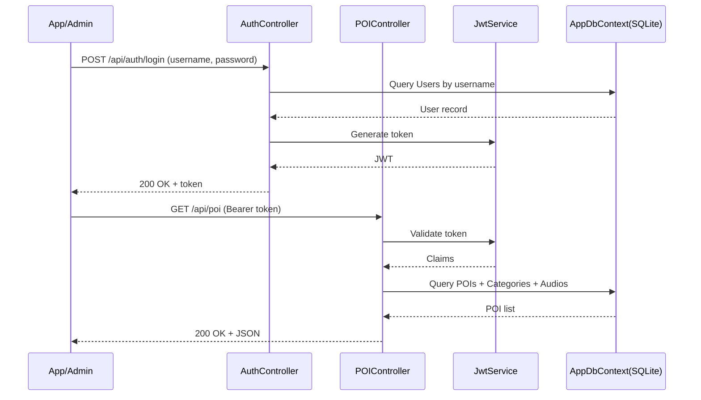

# Sequence Diagram - API Module

```mermaid
sequenceDiagram
    participant App as App/Admin
    participant Auth as AuthController
    participant Poi as POIController
    participant Jwt as JwtService
    participant Db as AppDbContext(SQLite)

    App->>Auth: POST /api/auth/login (username, password)
    Auth->>Db: Query Users by username
    Db-->>Auth: User record
    Auth->>Jwt: Generate token
    Jwt-->>Auth: JWT
    Auth-->>App: 200 OK + token

    App->>Poi: GET /api/poi (Bearer token)
    Poi->>Jwt: Validate token
    Jwt-->>Poi: Claims
    Poi->>Db: Query POIs + Categories + Audios
    Db-->>Poi: POI list
    Poi-->>App: 200 OK + JSON
```
