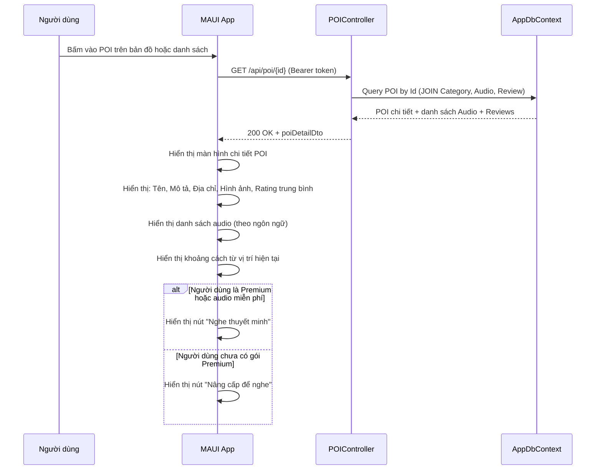
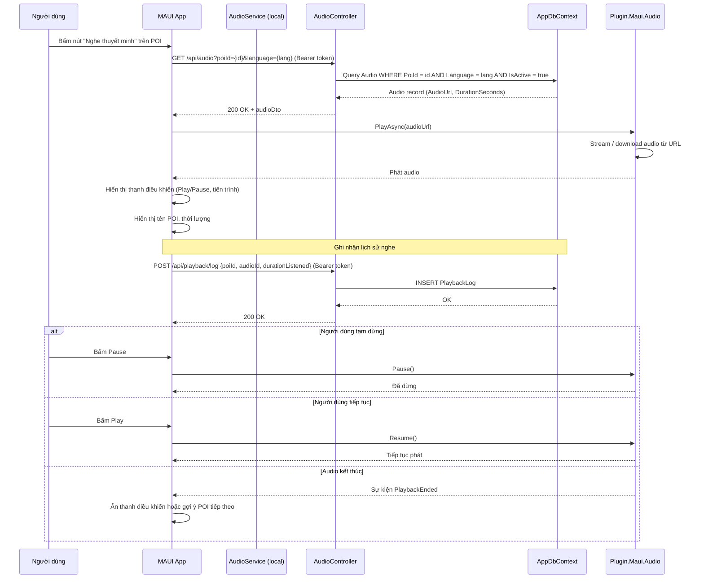
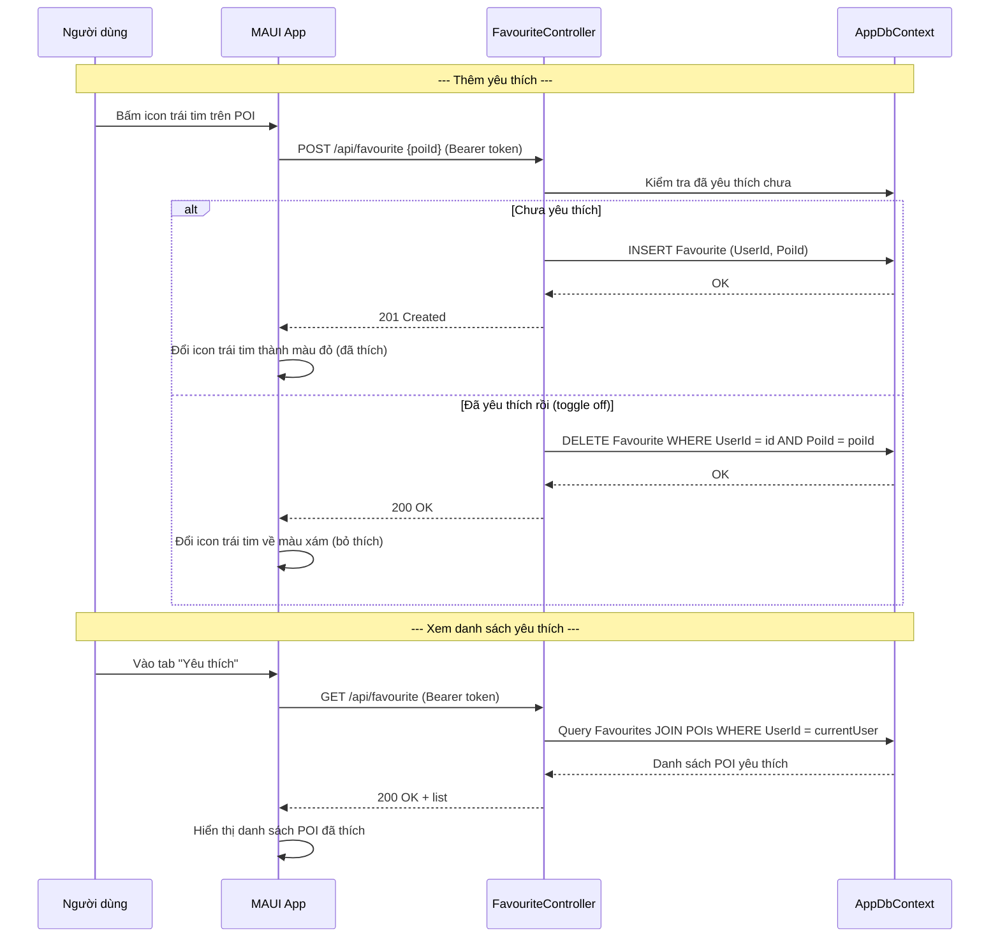
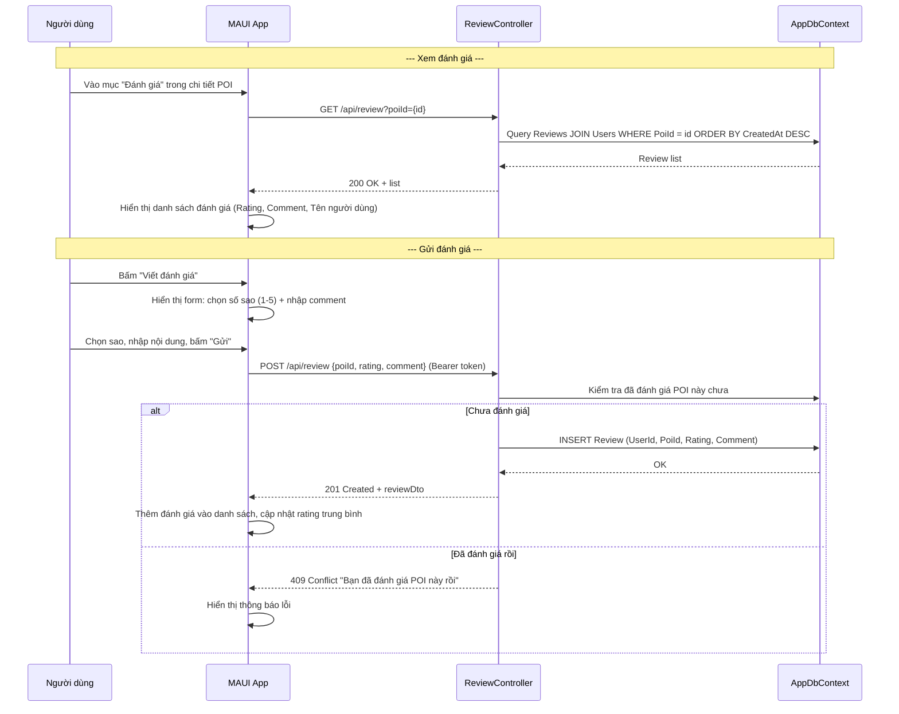
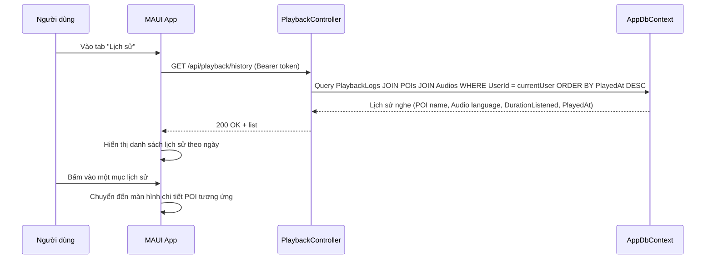
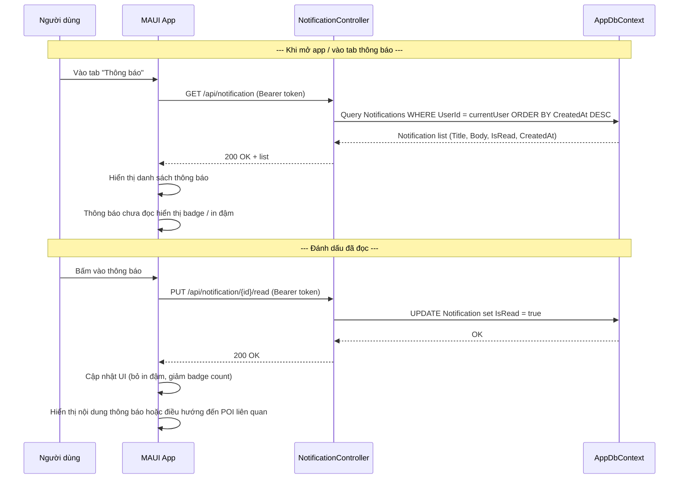
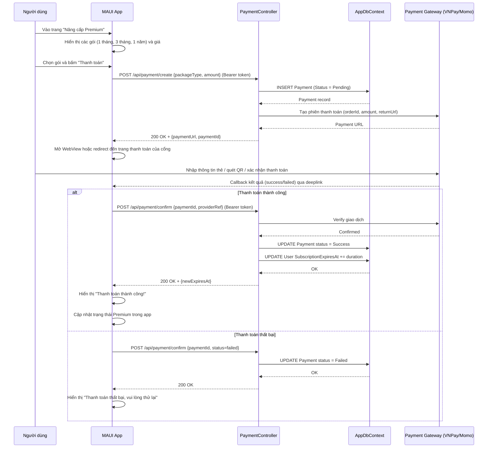
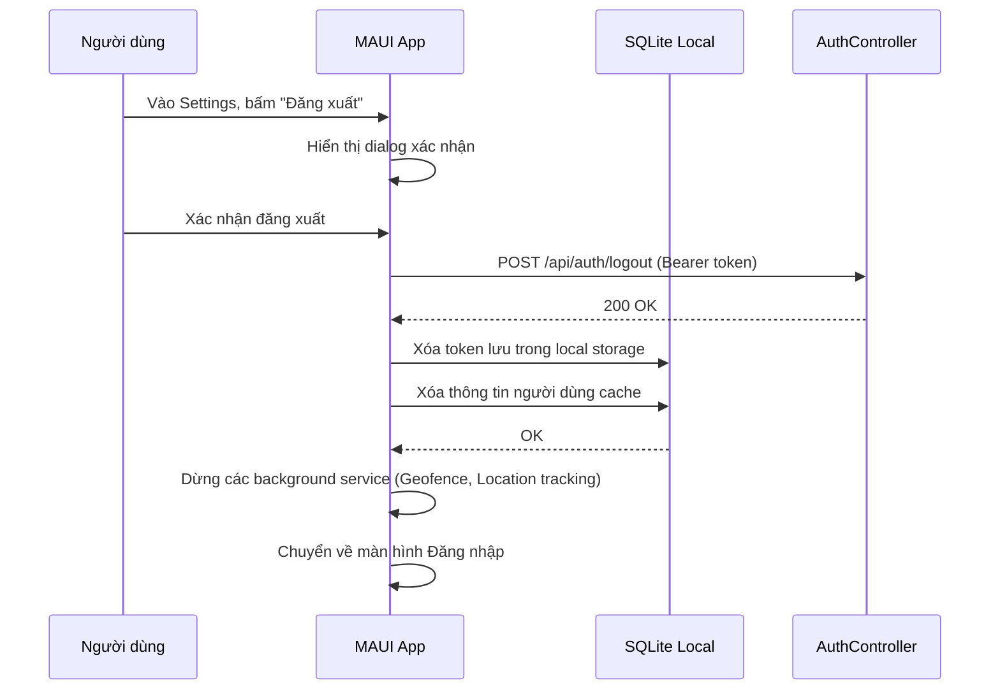
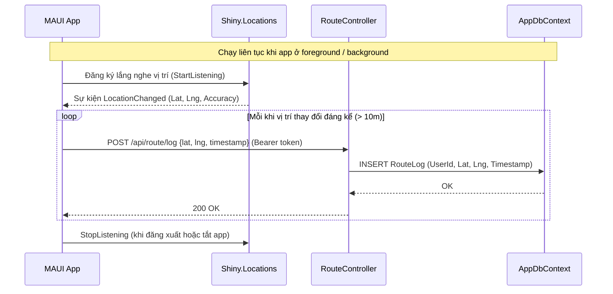
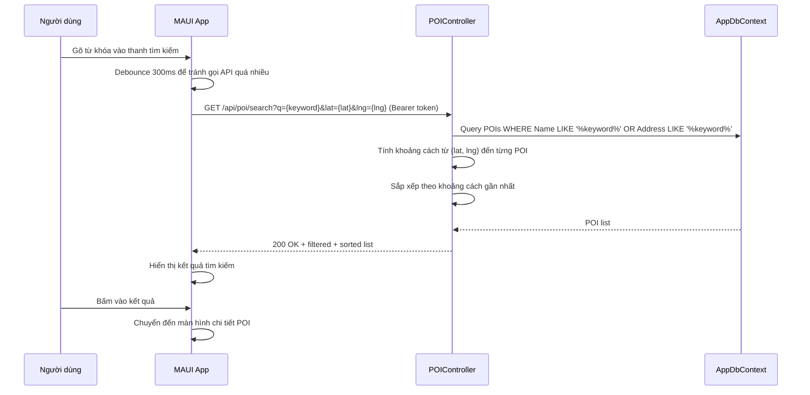

# Sơ đồ Sequence - App (Bổ sung)

> Các chức năng đã có file PNG riêng: Geofence, load map POI, QR code scan, đăng ký tài khoản, đăng nhập.  
> File này bổ sung các chức năng còn thiếu.

---

## 1. Xem chi tiết POI

---

## 2. Phát audio thuyết minh (thủ công)

---

## 3. Yêu thích POI (Favorites)

---

## 4. Đánh giá POI (Reviews)

---

## 5. Xem lịch sử nghe (Playback History)

---

## 6. Nhận và xem thông báo (Notifications)

---

## 7. Thanh toán / Gia hạn gói Premium

---

## 8. Đăng xuất

---

## 9. Cập nhật vị trí và ghi Route Log

---

## 10. Tìm kiếm POI

