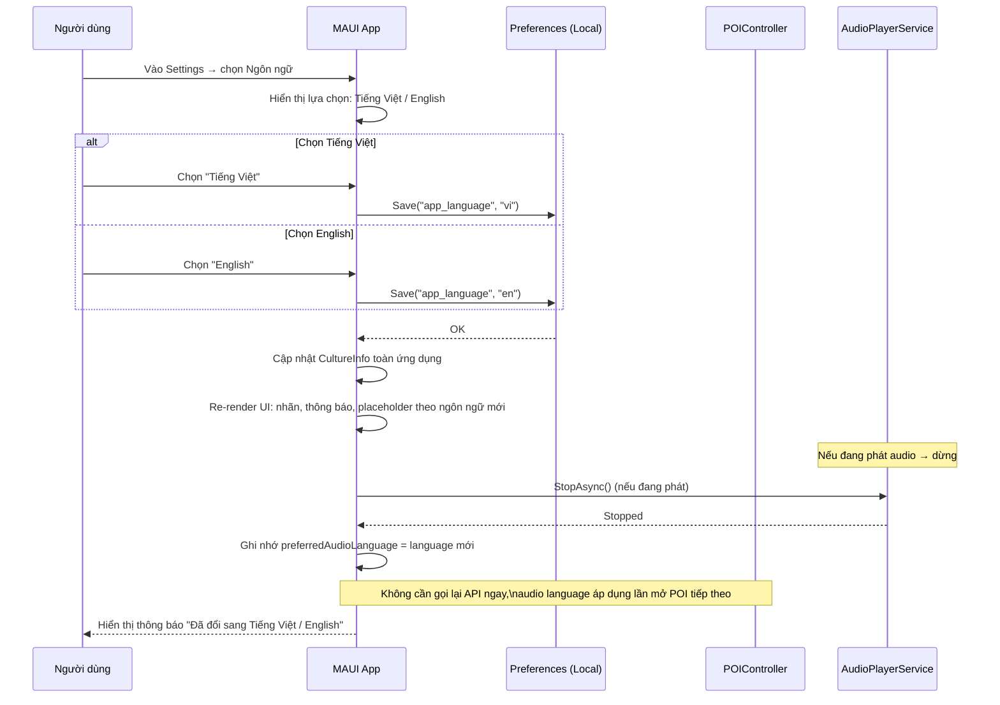
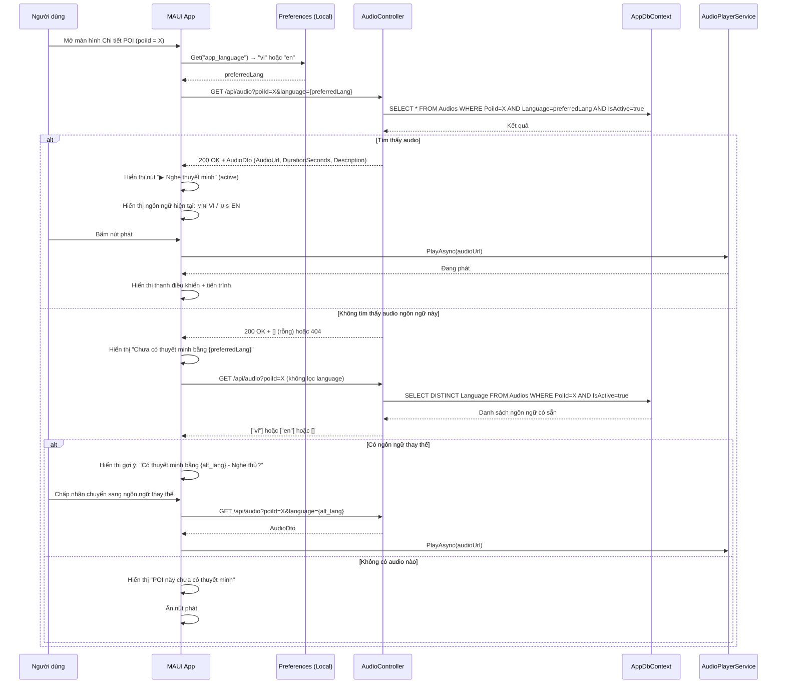
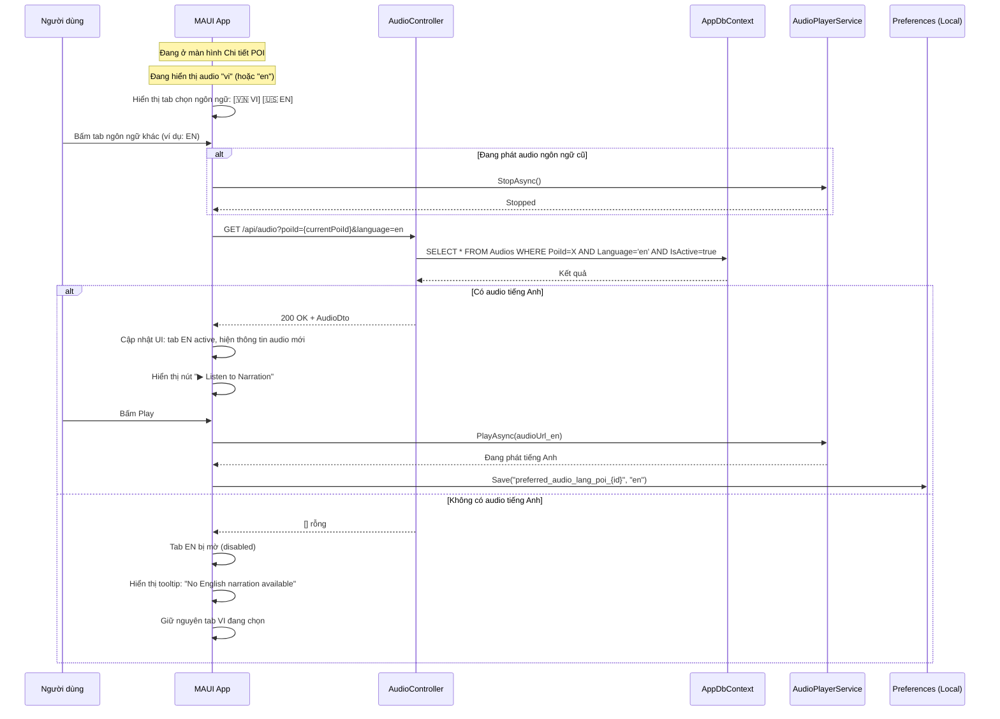
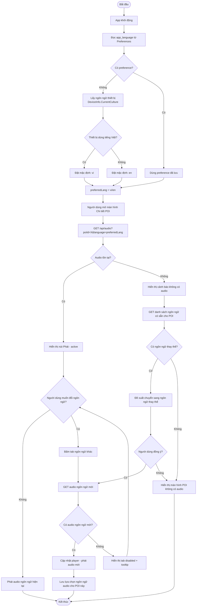
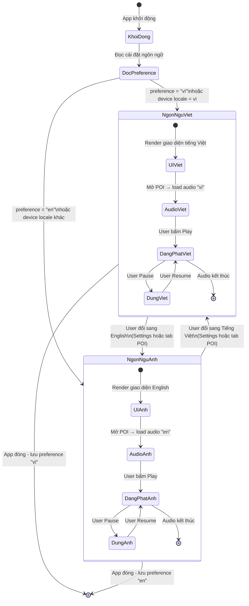
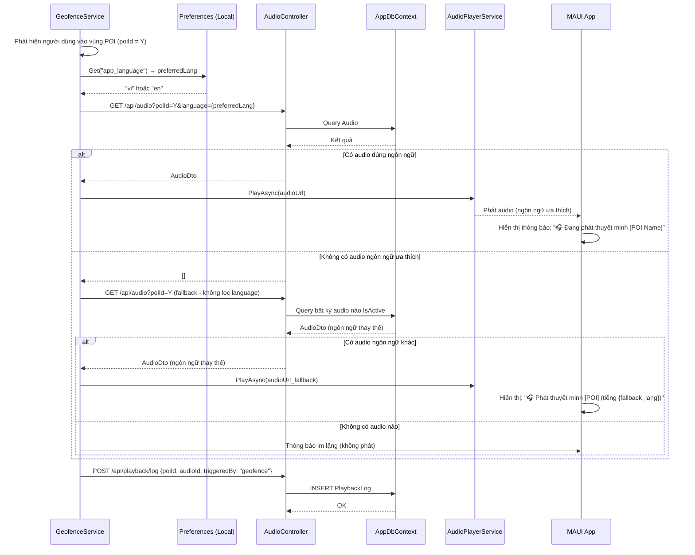

# Sơ đồ Chuyển đổi Ngôn ngữ (Tiếng Việt / Tiếng Anh) - App

---

## 1. Sequence: Người dùng đổi ngôn ngữ trong Settings

---

## 2. Sequence: Load audio theo ngôn ngữ khi mở chi tiết POI

---

## 3. Sequence: Chuyển ngôn ngữ audio ngay trong màn hình POI

---

## 4. Activity: Luồng hoạt động chọn ngôn ngữ audio

---

## 5. State Diagram: Trạng thái ngôn ngữ trong App

---

## 6. Sequence: Tự động phát Geofence theo ngôn ngữ ưa thích

