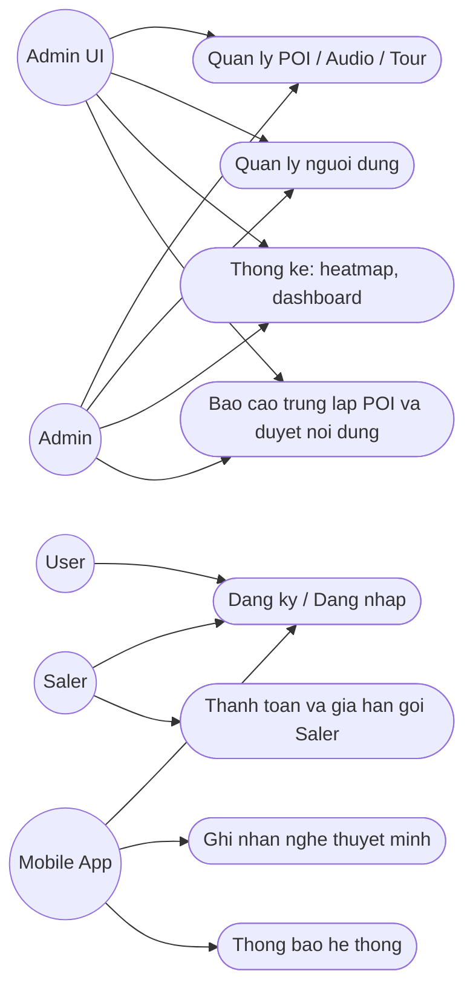

# Use Case Diagram - API Module

```mermaid
flowchart LR
    Admin((Admin))
    User((User))
    Saler((Saler))
    App((Mobile App))
    Web((Admin UI))

    UC1([Dang ky / Dang nhap])
    UC2([Quan ly POI / Audio / Tour])
    UC3([Ghi nhan nghe thuyet minh])
    UC4([Quan ly nguoi dung])
    UC5([Thong ke: heatmap, dashboard])
    UC6([Thanh toan va gia han goi Saler])
    UC7([Thong bao he thong])
    UC8([Bao cao trung lap POI va duyet noi dung])

    App --> UC1
    App --> UC3
    App --> UC7
    Web --> UC2
    Web --> UC4
    Web --> UC5
    Web --> UC8

    Admin --> UC2
    Admin --> UC4
    Admin --> UC5
    Admin --> UC8

    User --> UC1
    Saler --> UC1
    Saler --> UC6
```
